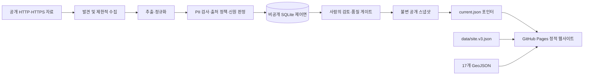

# 학교 e스포츠 지형도 2026

대한민국 17개 시·도의 학교 e스포츠 관련 공개자료를 검색·비교하는 근거 중심 데이터 탐색 웹사이트입니다. 교육청, 지방자치단체, 학교 담당자가 다른 지역의 대회, 정책, 시설, 동아리 및 교육과정 사례를 원문 근거와 함께 빠르게 확인할 수 있도록 만들었습니다.

이 지형도의 수치는 **공개자료에서 확인한 사례 수**입니다. 지역의 실제 활동 규모, 성과, 순위 또는 제도 성숙도를 뜻하지 않습니다. 검색되지 않은 활동 역시 부재가 확인되었다는 의미가 아닙니다.

## 프로젝트 개요

이 저장소는 다음 두 영역을 함께 관리합니다.

1. 검색·필터·지역 비교와 대표 사례를 한 작업공간에서 제공하는 학교 e스포츠 지형도
2. 공개자료를 안전하게 수집, 검토, 정규화하고 검증된 공개 스냅샷으로 출판하는 데이터 운영 체계

프론트엔드는 별도 프레임워크 없이 HTML, CSS, ES modules로 구현되어 GitHub Pages에 배포됩니다. 운영 파이프라인은 Python 3.11과 SQLite를 사용하며, 공개 웹사이트에는 비공개 운영 데이터베이스가 아니라 개인정보를 제거한 정적 JSON만 전달합니다.

## 현재 데이터 현황

현재 `data/site.v3.json` 기준 현황입니다.

| 항목 | 값 |
| --- | ---: |
| 스키마 버전 | 3 |
| 지역 | 17개 시·도 |
| 공개 사례 | 232건 |
| 출처 레코드 | 232건 |
| 지역 범위 사례 | 185건 |
| 전국·인접 범위 사례 | 2건 |
| 범위 미확정 사례 | 45건 |
| 높은 신뢰도 | 61건 |
| 중간 신뢰도 | 171건 |
| 운영 상태 재검토 필요 | 232건 |

카테고리별 사례 수는 다음과 같습니다.

| 카테고리 | 사례 수 |
| --- | ---: |
| 교육청대회·사업 | 55 |
| 협회사업 | 42 |
| 학교동아리·팀 | 41 |
| 대학학과·전공·동아리 | 27 |
| 지자체정책·조례 | 25 |
| 경기장·인프라 | 24 |
| 언론보도 | 16 |
| 특성화고학과·과정 | 2 |

모든 사례가 `needs_review`인 것은 해당 사례가 거짓이라는 뜻이 아닙니다. 현재 운영 중인지, 종료되었는지, 이후 변경되었는지를 독립적으로 다시 확인해야 한다는 뜻입니다. 화면에서도 이러한 상태를 운영 사실처럼 단정하지 않고 명시적으로 표시합니다.

## 주요 기능

### 검색 중심 작업공간

- 첫 화면에서 통합 검색, 지역 선택, 카테고리와 고급 필터를 바로 사용
- 적용된 조건을 제거 가능한 칩과 URL에 함께 반영해 결과 상태 공유
- 데스크톱 우측 상세 패널과 모바일 전체 화면 상세에서 목록 맥락과 포커스 보존
- 제목·지역·카테고리·연도·상태 중심의 간결한 카드와 12건 단위 점진 노출

### 전국 비교

- 17개 시·도와 8개 카테고리를 한 표에서 비교
- 탐색·비교 탭을 전환하고 지역, 카테고리, 개별 차트 구간에서 해당 사례 목록으로 바로 이동
- 사례 수를 순위나 활동 규모로 오해하지 않도록 시·도 공식 순서와 해석 안내를 고정
- 모바일에서는 표 내부 가로 스크롤과 고정 지역 열 지원

### 사례 탐색

- 지역 및 카테고리 필터
- 이름, 기관, 주소, 종목, 출처 통합 검색
- 유형, 학교급, 운영 상태, 범위, 정렬 조건을 제공하는 고급 필터
- URL에 검색 상태를 기록하여 선택 결과 공유 가능
- 각 사례의 상세 설명, 근거 출처, 신뢰도와 검토 상태 확인

### 전국 지역 선택 지도

- 전국 지도 또는 17개 지역 버튼에서 지역 필터 선택
- 선택 지역의 공개자료 건수와 주요 카테고리를 보조 패널에 표시
- 지도 자산이 실패해도 지역 버튼, 검색, 상세 기능은 계속 사용

### 연구 방법과 한계

`research/` 페이지에서 다음 내용을 별도로 설명합니다.

- 데이터셋의 범위와 유형화 방식
- 카테고리별 공개자료 분포
- 좌표 출처와 경계 라이선스
- 미확인·부분 증거와 데이터 공백
- 공개 데이터의 계보와 원문 데이터 링크

## 아키텍처



현재 대시보드의 외부화된 기준 데이터는 `baseline/v2/site.v2.json`이며, v3 작업 투영은 `data/site.v3.json`입니다. 기준 마이그레이션의 230개 사례와 17개 지역은 그대로 유지하고, 검토를 통과한 신규 사례는 `data/additions.v1.json`에서 추가합니다. 현재 공개 사례는 232건입니다.

운영 출판 경로에서는 SQLite가 후보, 리뷰, 정책, 감사 및 복구 체크포인트를 관리합니다. 공개 소비자는 SQLite를 직접 조회하지 않습니다. 검증을 통과한 데이터만 `snapshots/<snapshot_id>/snapshot.json`과 `manifest.json`으로 출판되며, `current.json` 포인터가 현재 스냅샷을 선택합니다. 포인터는 전체 번들과 해시 검증이 끝난 뒤 마지막에 갱신됩니다.

## 기술 구성

| 영역 | 기술 |
| --- | --- |
| 웹 UI | HTML5, CSS, JavaScript ES modules |
| 데이터 | JSON, JSON Schema, CSV, GeoJSON |
| 웹 빌드·검증 | Node.js, AJV |
| 브라우저 테스트 | Playwright, axe-core |
| 운영 파이프라인 | Python 3.11+, SQLite |
| 문서·배포 | GitHub Actions, GitHub Pages |

런타임 프론트엔드 의존성이나 번들러는 없습니다. 빌드 과정은 검증된 정적 파일을 `dist/`로 원자적으로 교체하고 입력 provenance와 릴리스 해시 manifest를 생성합니다.

## 디렉터리 구조

```text
.
├── index.html                 # 편집형 지형도 및 데이터 탐색 화면
├── assets/                    # 홈 편집 비주얼
├── research/                  # 연구 방법과 데이터 한계 페이지
├── src/                       # 웹 모듈 및 Python 운영 패키지
│   ├── app.js                 # 웹 애플리케이션 진입점
│   ├── matrix.js              # 전국 비교 매트릭스
│   ├── search.js              # 검색·필터 로직
│   ├── landscape.js           # 전국 지도와 지역별 공개자료 모델
│   └── esports_data/          # 수집·검토·검증·출판 Python 패키지
├── styles/                    # 디자인 토큰, 화면 CSS, 로컬 폰트
├── data/                      # v3 공개 데이터와 데이터 매핑
├── baseline/v2/               # 읽기 전용 v2 기준 데이터
├── geo/regions/               # 17개 시·도 GeoJSON
├── config/                    # 출처, 게시자, 최신성, 주장 정책
├── schemas/                   # 데이터·명령·출판 JSON Schema
├── migrations/                # SQLite 및 v2→v3 마이그레이션
├── scripts/                   # 추출, 검증, 빌드, 릴리스 검증 도구
├── tests/                     # Node, 브라우저 및 Python 테스트
├── docs/                      # 운영, 복구, 출처 정책 및 설계 문서
├── adr/                       # 주요 아키텍처 결정 기록
└── .github/workflows/         # 감사, 변경, 출판, 철회, Pages 배포
```

`dist/`, `.dist-stage-*`, `.extract-stage-*`, `.gjc/`, `artifacts/`, `test-results/`는 생성물 또는 로컬 작업용 디렉터리이며 Git의 프로젝트 소스가 아닙니다.

## 로컬 실행

### 요구 사항

- Node.js와 npm
- Python 3.11 이상
- 전체 브라우저 테스트를 실행할 경우 Playwright 지원 환경

### 설치

```bash
npm ci
# 별도로 준비해 활성화한 Python 가상환경에서 실행
python -m pip install --upgrade pip
python -m pip install -e '.[operations]'
npx playwright install
```

Python 운영 패키지가 필요하지 않고 웹사이트만 확인한다면 npm 설치만으로 빌드할 수 있습니다. Playwright 브라우저 설치도 브라우저 테스트를 실행할 때만 필요합니다.

### 개발 서버

애플리케이션이 JSON과 GeoJSON을 `fetch()`로 읽기 때문에 `index.html`을 파일로 직접 열지 말고 로컬 HTTP 서버를 사용합니다.

```bash
npm run build
python3 -m http.server 4177 --directory dist
```

브라우저에서 `http://127.0.0.1:4177/`을 엽니다. 연구 페이지는 `http://127.0.0.1:4177/research/`입니다.

소스 변경 후에는 `npm run build`를 다시 실행해야 `dist/`에 반영됩니다.

## 주요 명령

| 명령 | 설명 |
| --- | --- |
| `npm run extract` | v2 기준 데이터에서 v3 공개 데이터를 추출 |
| `npm run validate` | 데이터 구조, 참조, 지역 파일 및 공개 계약 검증 |
| `npm run build` | 검증 후 정적 사이트를 `dist/`에 생성 |
| `npm test` | JavaScript 단위 테스트 실행 |
| `npm run test:e2e` | 빌드 및 정적 계약 E2E 테스트 실행 |
| `npm run test:browser` | 데스크톱·모바일 Playwright 테스트 실행 |
| `npm run discovery:bootstrap` | 현재 공개 출처를 기존 확인 자료로 등록 |
| `npm run discovery:run` | 신규 출처 후보 수집 및 중복 제거 실행 |
| `npm run test:discovery` | 주간 수집·검토 계약 테스트 실행 |
| `npm run verify:release` | 추출부터 브라우저 및 릴리스 검증까지 전체 실행 |

Python 테스트는 다음과 같이 실행합니다.

```bash
PYTHONPATH=src python3 -m unittest discover -s tests/python -p 'test_*.py'
```

전체 릴리스 검증은 데이터 재추출을 포함합니다. 실행 전에 작업 트리가 깨끗한지 확인하고, 생성 결과가 의도한 입력과 동일한지 검토하십시오.

## Python 운영 CLI

설치 후 `esports-data` 또는 `python -m esports_data.cli`로 운영 명령을 실행할 수 있습니다.

| 하위 명령 | 역할 |
| --- | --- |
| `migrate` | v2 데이터를 v3 제어면으로 마이그레이션 |
| `collect-offline-fixture` | 네트워크 요청 없이 로컬 개발용 JSON fixture를 추출 |
| `verify` | 데이터베이스의 출판 후보 검증 |
| `review` | 검토 명령 적용 |
| `audit` | 무결성, 외래 키, 운영 게이트 감사 |
| `promote-mutation` | 승인된 변경을 후보 브랜치로 승격 |
| `publish` | 승인과 품질 보고서를 검증하고 불변 스냅샷 출판 |

운영 CLI는 fail-closed 방식입니다. 입력, 정책, 승인, 서명, 해시 또는 측정값이 누락되거나 모호하면 추정값으로 진행하지 않고 차단 결과를 반환합니다. 실제 출판은 저장소의 보호된 GitHub Actions 워크플로를 통해 수행하는 것을 전제로 합니다.

## 주간 신규 자료 수집

`Weekly source discovery` 워크플로는 매주 월요일 09:00(KST)에 교육부·17개 시도교육청 홈페이지와 최근 14일 검색 RSS를 확인합니다. URL은 문서 번호 같은 식별용 쿼리를 유지하고 추적 파라미터와 프래그먼트만 제거한 뒤, `data/discovery/seen.v1.json`의 기존 URL 해시와 비교합니다. 제목은 원문 대신 정규화한 SHA-256 지문만 저장해 동일 제목의 다른 URL도 중복 가능 후보로 표시합니다.

새 URL이 있으면 `automation/discovery-*` 브랜치와 검토용 PR을 생성합니다. 공개 데이터인 `data/site.v3.json`은 자동으로 수정하지 않습니다. 이전 수집 PR이 열려 있으면 새 PR을 중복 생성하지 않고 기존 PR의 장부에 새 후보를 추가합니다.

후보 검토 결과는 다음 명령으로 기록합니다.

```bash
# 공개 데이터의 기존 항목에 연결해 채택
PYTHONPATH=src python3 -m esports_data.review_discovery \
  --candidate candidate-0123456789abcdef --decision accepted --entry-id entry-id

# 중복 또는 제외 처리
PYTHONPATH=src python3 -m esports_data.review_discovery \
  --candidate candidate-0123456789abcdef --decision duplicate
PYTHONPATH=src python3 -m esports_data.review_discovery \
  --candidate candidate-0123456789abcdef --decision rejected
```

채택·중복·제외 결과도 확인 이력에 남으므로 이후 수집에서는 같은 URL을 다시 후보로 만들지 않습니다. `accepted`는 실제 공개 항목 ID가 있을 때만 허용하며, 후보를 공개 데이터에 추가하는 작업은 자료 내용과 개인정보를 사람이 확인한 뒤 별도 변경으로 진행합니다.

## 데이터 모델

`data/site.v3.json`의 주요 컬렉션은 다음과 같습니다.

- `regions`: 17개 시·도와 지리·출처 메타데이터
- `entries`: 화면에 표시되는 232개 사례(기준 230건 + 검토 완료 신규 2건)
- `sources`: 사례별 공개 출처와 검증 상태
- `negative_evidence`: 제한된 검색에서 직접 근거를 찾지 못한 기록
- `data_gaps`: 확정하지 못한 주장과 다음 검증 경로
- `typology_axes`: 사례를 분류하는 유형화 축
- `coverage_by_category`: 카테고리별 공개자료 범위
- `raw_source_crosswalk`: 기존 출처와 정규화된 출처의 연결

각 공개 사례는 안정적인 ID, 지역, 카테고리, 자원 유형, 범위, 근거 및 출처 참조를 가집니다. `operational_status`는 현재 운영 상태이고 `confidence`는 근거 평가이므로 서로 대체할 수 없습니다. 신뢰도가 높더라도 현재 상태가 자동으로 검증되는 것은 아닙니다.

상세 계약은 [`docs/data-contract.md`](docs/data-contract.md), 스키마는 [`schemas/site.v3.schema.json`](schemas/site.v3.schema.json)을 참조하십시오.

## 출처 및 개인정보 정책

이 프로젝트는 공개적으로 접근 가능한 HTTP(S) 자료만 대상으로 합니다.

- 로그인, 계정, 유료장벽 우회, 비공개 API 또는 인증된 브라우저 세션을 사용하지 않음
- robots 지침, 출처 약관, 게시자 allowlist 및 리디렉션 범위를 확인
- 응답 크기, 시간 제한과 재시도 횟수를 제한
- 원문 응답 본문은 영구 저장하지 않고 필요한 최소 사실만 추출
- 미성년자의 이름, 핸들, 연락처, 정밀 위치 또는 식별 가능한 일정은 저장하지 않음
- 의심스럽거나 정책이 불명확한 자료는 본문이나 PII 없이 불투명한 사건 ID와 안전한 진단 정보만 격리
- 독립적인 근거가 필요한 주장은 게시자 통제와 정보 기원 양쪽에서 독립성을 확인

자세한 규칙은 [`docs/source-policy.md`](docs/source-policy.md)를 참조하십시오.

## 품질 및 출판 게이트

정상 출판은 다음 기준을 모두 만족해야 합니다.

| 측정값 | 기준 |
| --- | ---: |
| 핵심 범위 충족률 | 99% 이상 |
| 필수 스키마 필드 충족률 | 100% |
| 품질 필드 충족률 | 98% 이상 |
| 잘못된 공개 | 0건 |
| 자동 오병합 | 0건 |
| PII 발견 | 0건 |
| 기한이 지난 검토 | 0건 |
| 예산 상태 | `PASS` |
| 중지 요청 | `false` |

스키마, 참조, 체크섬도 모두 유효해야 하며 측정값 누락은 실패로 처리합니다. Pages 배포에는 데이터 검증 외에도 사용성, 디자인, 브라우저 매트릭스, 자원 매핑 및 저장소 소유자의 사람 승인이 필요합니다.

관련 문서:

- [`docs/operations.md`](docs/operations.md): 운영 책임, 검토 주기, 중지·철회 절차
- [`docs/pages-release.md`](docs/pages-release.md): GitHub Pages 배포와 롤백
- [`docs/recovery.md`](docs/recovery.md): 체크포인트 복구와 PII 사고 대응
- [`adr/0001-storage-publication.md`](adr/0001-storage-publication.md): 비공개 SQLite와 공개 불변 투영 결정
- [`adr/0002-minor-data.md`](adr/0002-minor-data.md): 미성년자 데이터 처리 결정
- [`adr/0003-identity-lineage.md`](adr/0003-identity-lineage.md): 신원 및 계보 결정

## GitHub Actions

| 워크플로 | 목적 |
| --- | --- |
| `pages.yml` | 선택한 소스를 재검증·빌드하고 단일 Pages artifact 배포 |
| `mutation.yml` | 승인된 데이터 변경을 격리된 후보 ref에 반영 |
| `audit.yml` | 비공개 체크포인트, 품질, PII 및 예산 상태 감사 |
| `publish.yml` | 승인된 불변 스냅샷과 현재 포인터 출판 |
| `emergency-withdraw.yml` | 유해 공개 데이터의 제거 전용 긴급 스냅샷 처리 |

워크플로는 동시 변경으로 인한 충돌을 막기 위해 공통 제어면 concurrency group을 사용합니다. 긴급 철회도 기존 레코드 수정이나 신규 추가를 허용하지 않고 제거만 허용합니다.

## 변경 시 주의사항

- `baseline/v2/`는 외부화된 읽기 전용 기준선입니다.
- 기준 마이그레이션의 230개 사례와 17개 지역은 바꾸지 말고, 신규 사례는 `data/additions.v1.json`에 추가하십시오.
- 공개 사실을 수정할 때는 화면 문자열만 고치지 말고 근거, 출처 참조와 계보를 함께 갱신하십시오.
- 상태와 신뢰도를 혼동하지 마십시오. 근거 신뢰도가 높다는 이유로 운영 상태를 검증 완료로 변경할 수 없습니다.
- 지역 GeoJSON은 정확히 17개여야 하며 빌드 시 검증됩니다.
- 공개 스냅샷은 생성 후 수정하지 않습니다. 새 스냅샷을 만들고 검증된 포인터를 갱신합니다.
- 데이터 변경 후 최소한 `npm run validate`, JavaScript 테스트, Python 테스트를 실행하십시오.
- UI나 배포 계약 변경 시 브라우저 테스트와 `npm run verify:release`까지 실행하십시오.

## 현재 한계

- 공개자료 기반 인덱스이므로 전국의 실제 활동을 완전하게 포괄하지 않습니다.
- 공개 검색 가능성과 기관별 문서 공개 수준에 따라 지역·카테고리별 편향이 존재할 수 있습니다.
- 현재 232개 사례 모두 운영 상태의 독립적인 재검증이 필요합니다.
- 좌표 일부는 기존 데이터의 행정구역 중심점과 결정적 jitter를 사용한 근사값이며 실제 행사장 또는 기관의 정확한 위치가 아닐 수 있습니다.
- 지도는 비교와 탐색을 위한 참고 자료이며 법적·측량 목적에 사용할 수 없습니다.
- 저장소 루트에는 전체 프로젝트 라이선스 파일이 없습니다. 포함된 폰트의 라이선스는 `styles/fonts/`에서 별도로 확인해야 합니다.

## 문서 안내

처음 참여한다면 다음 순서로 읽는 것을 권장합니다.

1. 이 README
2. [`docs/data-contract.md`](docs/data-contract.md)
3. [`docs/source-policy.md`](docs/source-policy.md)
4. [`docs/operations.md`](docs/operations.md)
5. 작업과 관련된 [`adr/`](adr/) 기록

화면 설계의 최근 배경은 [`docs/superpowers/specs/2026-07-14-benchmarking-home-redesign-design.md`](docs/superpowers/specs/2026-07-14-benchmarking-home-redesign-design.md)에서 확인할 수 있습니다.
